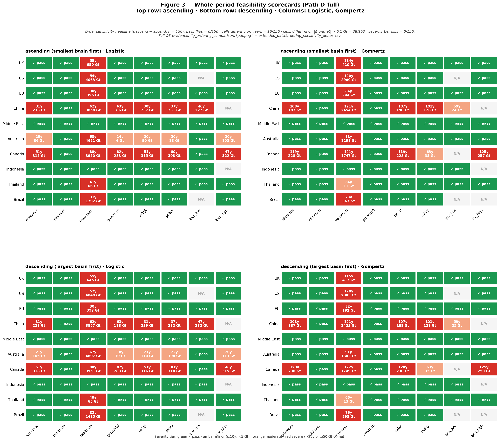
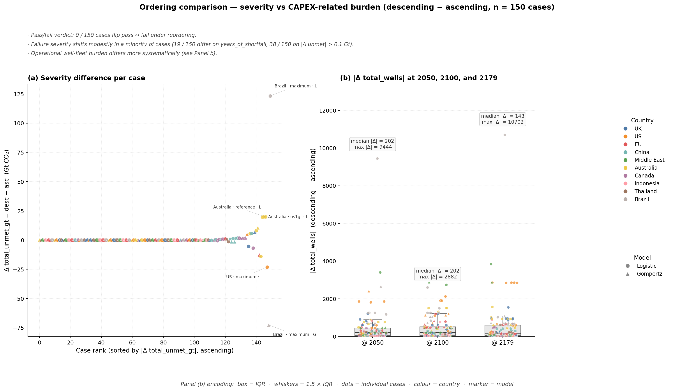
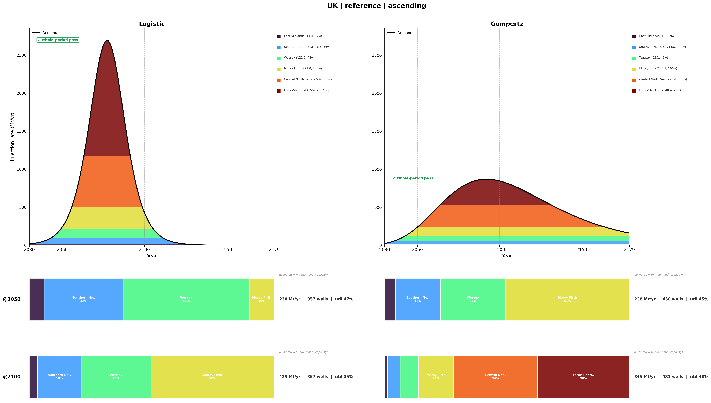
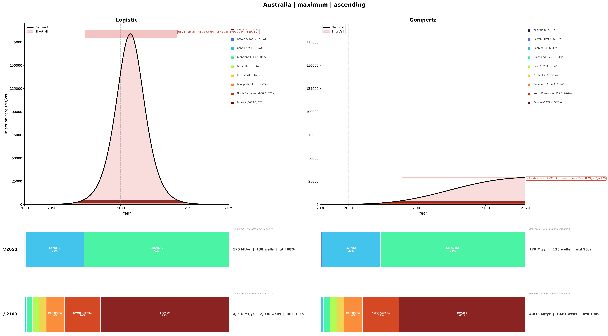
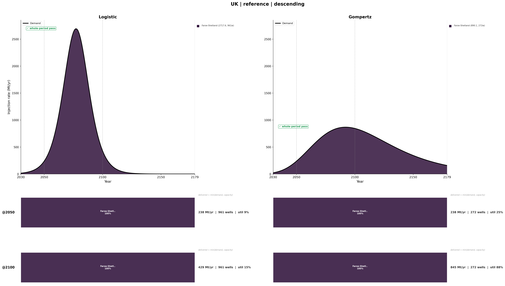

# 02 CO₂BLOCK Screening (Part 2)

This part takes the deterministic country storage-demand curves from
Part 1 (the active V8 central pathways in
`01_growth_model/output/v8_2026-06-01`) and screens them against
the actual geological basin portfolio. The screening engine is a
Python port of Iman De Simone & Krevor's CO₂BLOCK MATLAB algorithm
(reference implementation in `../90_reference_matlab/`).

The active Part-1 country pool is Australia, Brazil, Canada, China, EU
(without UK), Indonesia, Middle East, Thailand, UK, and US. The
screening outputs below are the V8 results, regenerated from the V8
growth paths against the 123-basin V8 resource matrix.

The V8 screening package (June 2026) is organised around three questions,
each with its own output:

| Question | Artefact | Headline answer |
|---|---|---|
| Q1: Can the basin portfolio match the growth curve? | Fig 3 (2×2 scorecards) + `case_model_shortfall_windows.csv` | 111 / 150 pass, 39 / 150 fail (whole-horizon) |
| Q2: Why does each case pass or fail? | Fig 4 country profiles | basin-by-basin stacked rate curves with the shortfall band overlaid |
| Q3: Does ordering change feasibility or only infrastructure? | `fig_ordering_comparison` (separate top-level figure) + `extended_data/ordering_sensitivity_deltas.csv` | Feasibility verdict is order-invariant (0/150 flips). Failure severity moves modestly (19/150 differ on years). Operational well fleet differs systematically (median \|Δ\| @ 2100 = 202, max = 2 882). |

Each question maps to a separate figure. The verdict is robust to
allocation ordering; what changes between strategies is the
infrastructure cost of delivering it.

## Pipeline

```
Part 1 output: V8 deterministic central storage-rate paths
  -> Part 2 step 1: precompute basin x period resource matrix
       (Nordbotten, EOS, geomech failure) -> basin_period_resource_long.csv
  -> Part 2 step 2: allocation + post-processing against the country demand path
       -> screening_summary.csv
       -> case_model_*.csv (4 tables)
       -> fig3_dashboard.{pdf,png}          (Q1)
       -> fig_ordering_comparison.{pdf,png} (Q3)
       -> country_profiles/*                (Q2)
       -> ordering_sensitivity_deltas.csv   (Q3 supp.)
```

The workflow has two stages.

- Stage A, allocation core (slow, ~10-15 min). Produces raw
  per-case basin assignment files plus `screening_summary.csv`.
  Re-run only when the geological database or growth curves change.
- Stage B, notebook post-processing and figures (fast, ~2 min with
  `SKIP_ALLOCATION = True`). Produces all CSVs and figures.

```bash
# Stage A
cd 02_co2block_screening/code
python run_step2_screening.py

# Stage B
cd ../notebooks
# Confirm cell 7 has  SKIP_ALLOCATION = True
jupyter nbconvert --to notebook --execute --inplace \
    --ExecutePreprocessor.kernel_name=python3 \
    --ExecutePreprocessor.timeout=600 \
    step2_allocation_screening.ipynb
```

## Pass criterion (Path D-full, whole-horizon)

For each `(country, scenario, model)` case the screened path is
computed year by year over 2030-2179. The case passes if and only
if there is zero shortfall in any year:

```
gap(y)              = max(0, raw_demand(y) − screened(y))
years_of_shortfall  = count of years where gap(y) > 0.01 Mt/yr
whole_period_pass   = years_of_shortfall == 0
```

`whole_period_pass` is the primary feasibility verdict. It is distinct
from `status == "ok"` in `screening_summary.csv`, which only means
the allocation core ran without error. A case can be `status = ok`
and `whole_period_pass = False` at the same time.

Severity tiers (used to colour Fig 3 Panel (a)):

| Tier | Threshold | Colour |
|---|---|---|
| pass | `years_of_shortfall == 0` | green |
| minor | ≤ 10 years AND < 5 Gt unmet | amber |
| moderate | ≤ 25 years OR < 50 Gt unmet | orange |
| severe | > 25 years OR ≥ 50 Gt unmet | red |

## Figure 3: Whole-period feasibility scorecards (asc / desc)

A single 2×2 figure with both allocation orderings shown directly:
top row = ascending, bottom row = descending. Columns = Logistic /
Gompertz. Each cell encodes one `(country, scenario, model, ordering)`
verdict.



### Cell encoding

* Green (pass): zero shortfall over the whole horizon.
* Amber Xy / Y Gt: minor failure (≤ 10 years short, < 5 Gt unmet).
* Orange: moderate failure.
* Red: severe failure (> 25 years OR ≥ 50 Gt unmet).

The V8 scorecard covers the active country pool: Australia, Brazil,
Canada, China, EU, Indonesia, Middle East, Thailand, UK, and US. All
ten resolve to matched basins (South Korea, which had no matched basin,
has been dropped from the pool).

### How to read the two rows

The two rows look almost identical, and that is the result: the
whole-period pass/fail verdict is order-invariant. 0 / 150 cases
flip pass to fail between ascending and descending. The headline
banner above the figure reports the small residual differences:

* 19 / 150 cells show different `years_of_shortfall` values.
* 38 / 150 cells show `|Δ unmet| > 0.1 Gt`.
* 0 / 150 cells cross a severity tier.

For the magnitudes of these residual differences and the much
larger ordering effect on infrastructure burden, see the next figure.

At a glance, the figure shows which 39 of 150 cases require
infrastructure beyond what the matched basin portfolio can provide,
and confirms visually that this verdict is robust to allocation
ordering.

## Figure: Ordering comparison, severity vs CAPEX-related burden (Q3)

A dedicated 2-panel figure addressing Q3 directly. Saved at
`output/step2_screening/fig_ordering_comparison.{pdf,png}`.



### Panel (a): severity difference per case

One dot per case (n = 150), x = rank by `|Δ total_unmet_gt|`, y =
`Δ total_unmet_gt (desc − asc)` in Gt CO₂. Country = colour, model =
marker (○ Logistic, △ Gompertz).

What it shows:

* For most of the x-axis the points sit in a flat band along y = 0:
  most cases have negligible or small ordering differences in
  integrated shortfall.
* A small tail of outliers at the right marks the cases where
  ordering matters most. Top outliers include Brazil maximum Logistic,
  Brazil maximum Gompertz, US maximum Logistic, and high-demand
  Australia Logistic cases.
* The panel title reports the categorical headline: 0/150 pass-flips,
  19/150 cases differ on `years_of_shortfall`, 38/150 differ on
  `|Δ unmet| > 0.1 Gt`.

Ordering can modestly shift failure severity in a small minority of
cases, but it never flips the pass/fail verdict.

### Panel (b): operational well-fleet difference per case

Three box-and-strip plots of `|Δ total_wells|` (descending −
ascending) at the three checkpoints 2050, 2100, 2179. Each dot is
one case, coloured by country, marker by model. Median and max
annotations are written above each box.

What it shows:

* `@ 2050`: median |Δ wells| = 202, max = 9 444.
* `@ 2100`: median |Δ wells| = 202, max = 2 882.
* `@ 2179`: median |Δ wells| = 143, max = 10 702.

Ordering changes the operational well fleet by hundreds to thousands
of wells, far more systematically than it changes failure severity.

### Reading the two panels together

| What ordering does | Evidence |
|---|---|
| Does NOT change pass/fail verdict | Panel (a) headline "0 / 150 pass-flips" |
| Modestly shifts failure severity in a minority | Panel (a) outlier tail |
| Systematically changes operational well fleet | Panel (b) distributions |

Read ascending and descending as a bracket on infrastructure cost,
not as alternative feasibility hypotheses.

The full per-case data is in
[`output/step2_screening/extended_data/ordering_sensitivity_deltas.csv`](output/step2_screening/extended_data/ordering_sensitivity_deltas.csv).

## Figure 4: per-country combined profile

For each `(country, scenario, ordering)` we render one figure under
[`output/step2_screening/{ordering}/figures/country_profiles/`](output/step2_screening/ascending/figures/country_profiles/).
Logistic on the left, Gompertz on the right, sharing a y-axis. Three
rows per side:

1. Top row: stacked basin-by-basin injection-rate curves (one
   colour per basin) with the demand line in black. A red shortfall
   band marks where the screened sum falls below demand. A green badge
   (`whole-period pass`) or red annotation strip (`Xy shortfall, Y
   Gt unmet, peak Z Mt/yr @ year`) sits above each curve.
2. Middle row: basin-share proportion bar at year 2050. Each segment
   is one basin's share of total country rate that year, with width
   proportional to share. Right-side caption: `rate Mt/yr | wells | util`.
3. Bottom row: basin-share proportion bar at year 2100 (same encoding).

### Example 1: a passing case (UK, reference, ascending)



What to read:

* Top row: under Logistic the demand peaks ~2070 then declines;
  the legend lists six basins (Faroe-Shetland, Central North Sea,
  Moray Firth, Wessex, Southern North Sea, East Midlands), of which
  four are simultaneously active at 2100 (the others have finished their
  service window or are not yet drawn on). Under Gompertz the demand is
  gentler and longer-tailed; six basins ride along into the tail. Both
  carry the green whole-period pass badge.
* Bottom rows: the Logistic operational well fleet holds steady at
  357 wells (2050 and 2100); Gompertz grows from 456 (2050) to
  481 (2100). The Logistic active basins run at high utilisation,
  three at 100 % and Moray Firth at ~74 %.

### Example 2: a failing case (Australia, maximum, ascending)



What to read:

* Top row (Logistic side): the maximum-scenario demand peaks at
  ~180 000 Mt/yr around 2100, far above what the Australian basin
  portfolio can deliver. The shortfall band runs almost the entire
  horizon (`68y shortfall, 4 621 Gt unmet, peak 179 100 Mt/yr @ 2107`).
  Even at peak the portfolio is saturated: nine basins stacked to the
  limit. Under Gompertz the demand is much lower (peak gap rate
  ~24 958 Mt/yr at 2179) but still produces a 91-year tail shortfall.
* Bottom rows: at 2100 the Logistic case has driven the
  operational well fleet to 2 036 wells at 100 % utilisation. Every
  basin is fully loaded and still cannot match demand.

### Example 3: same case, different ordering (UK, reference, descending)



This is the same demand curve as Example 1, but under descending the
allocation picks the single largest basin (Faroe-Shetland) and
runs the whole curve through it. The top row shows one solid block
instead of the multi-basin stack. Result:

|  | Ascending (Ex. 1) | Descending (Ex. 3) | Δ |
|---|---:|---:|---:|
| Active basins @ 2100 (Logistic) | 4 | 1 | −3 |
| Wells @ 2050 (Logistic) | 357 | 961 | +604 |
| Wells @ 2100 (Logistic) | 357 | 961 | +604 |
| Utilisation @ 2100 (Logistic) | ~94 % (3 basins at 100 %) | 15 % | n/a |
| `whole_period_pass` | pass | pass | same |

Same verdict, very different physical footprint. This is the
ordering-bracket result that `fig_ordering_comparison.{pdf,png}`
summarises across all 150 cases.

## Output files

### Per-ordering CSVs (under `output/step2_screening/{ascending,descending}/final/`)

| File | Purpose |
|---|---|
| `screening_summary.csv` | One row per allocation run with `status` (`ok` / `no_basin_identified` / `allocation_error: …`). Not a feasibility verdict. |
| `case_model_screened_paths.csv` | Year × case matrix: `year`, `raw_rate_mt_yr` (demand), `screened_rate_mt_yr` (delivered). Drives Fig 4 top row. |
| `case_model_portfolio_metrics.csv` | Per-case-and-checkpoint summary at 2050 / 2100 / 2179. Reports `total_wells` (operational fleet snapshot), `n_eff`, `r_cumulative`, etc. Feeds the Q3 ordering-comparison figure (Panel b box-and-strip plots). |
| `case_model_basin_metrics.csv` | Per (basin, checkpoint) row. Drives the Fig 4 share-proportion bars. |
| `case_model_shortfall_windows.csv` (main) | Primary feasibility verdict. One row per feasible case with `whole_period_pass`, `years_of_shortfall`, `first/last_shortfall_year`, `max_gap_*`, `total_unmet_volume_gt`. |

### Cross-ordering supplement (under `output/step2_screening/extended_data/`)

| File | Purpose |
|---|---|
| `ordering_sensitivity_deltas.csv` | One row per case (n = 150) with descending − ascending Δ on verdict, severity, and 2050/2100/2179 infrastructure proxies. Backs `fig_ordering_comparison.{pdf,png}` (both panels) and the order-sensitivity supplement table. |

See [`docs/CSV_DATA_DICTIONARY.md`](docs/CSV_DATA_DICTIONARY.md) for the
full column-level schema of every file.

## Reading `ascending` vs `descending`

| Ordering | Allocation rule | What it represents |
|---|---|---|
| `ascending` | Smallest basin first, descend in size | A diversified, many-basin operation that spreads risk |
| `descending` | Largest basin first, ascend in size | A consolidated, mega-project operation that concentrates capacity |

What does not change between the two:

* The whole-period pass/fail verdict: 0 / 150 cases flip.
* The severity tier shown on Fig 3: 150 / 150 cells stay in the
  same colour band.

What changes modestly between the two:

* `years_of_shortfall`: 131 / 150 are identical; 19 differ between orderings.
* `total_unmet_volume_gt` (and hence cumulative delivery, since
  cumulative demand is identical): 38 / 150 differ by > 0.1 Gt,
  and the largest differences occur in high-demand maximum-scenario
  cases. So total cumulative delivery is close but not strictly
  identical between orderings.

What changes systematically between the two:

* Identity of basins active at each year (very different: UK
  descending uses 1 basin, UK ascending uses 6).
* Operational well-fleet size (`total_wells @ 2100`: median |Δ| =
  202, max |Δ| = 2 882).
* Effective basin diversity `n_eff` and per-basin utilisation.

Read the two orderings as a bracket on infrastructure cost, not
as alternative feasibility hypotheses. They tell you what the
diversification-to-consolidation trade-off costs in wells, with a
small residual effect on severity, but they do not flip whether a
country can or cannot meet its demand.

## Main results

At the portfolio level (n = 150 feasible cases, scenarios ×
countries × models):

* 111 cases pass (`whole_period_pass = True`) under both orderings.
* 39 cases fail under both orderings.
* 0 cases flip pass to fail between ascending and descending.
* The severe failures visible in Fig 3 are concentrated in the
  highest-demand scenario/model combinations, where the required
  growth path exceeds the screened basin portfolio over part of the
  150-year horizon.

At the infrastructure level:

* Median |Δ wells| between orderings is 202 at 2100.
* Maximum |Δ wells| is 9 444 at 2050, 2 882 at 2100, and
  10 702 at 2179.
* The identity and count of active basins can differ substantially
  even when both orderings give the same whole-period pass/fail
  verdict.

For the paper: across the active 10-country pool (Australia, Brazil,
Canada, China, EU, Indonesia, Middle East, Thailand, UK, US), the basin
portfolios meet 111 of 150 scenario-model demand paths. The 39 failures
are dominated by the `maximum` scenario and concentrate in Canada, China,
and Australia. The choice between ascending and descending allocation
orderings does not change which cases pass; it changes the operational
well-fleet size by a median of ~200 wells at 2100, with larger outliers
at 2050 and 2179.

## Allocation fidelity: MATLAB last-step rule

The greedy allocation follows the MATLAB reference
(`../90_reference_matlab/algorithm2/Algorithm2_with modified last
allocation step/CO2BLOCK.m`). Once the cumulative allocated rate reaches
the growth-curve peak, the last region is recomputed for the minimum
number of sites that still meets the remaining rate and volume, and the
inner storage-period search then breaks immediately (`break_max_rate`).
The Python core enforces this with `MATLAB_LAST_STEP_BREAK = True` in
[`code/co2block_py/allocation.py`](code/co2block_py/allocation.py).

An earlier port omitted that break and let the period search continue,
over-allocating the marginal region. Adopting the MATLAB rule changed the
well count in ~72 % of cases (the legacy code over-allocated, by up to
~9 800 wells), but left the whole-period pass/fail verdict unchanged in
all 300 case-orderings. It corrects the infrastructure (well-fleet)
metrics only, not feasibility.

## Folder structure

```
02_co2block_screening/
  README.md                                       this file
  code/
    co2block_py/                                  Python port of CO₂BLOCK
    run_step1_precompute.py                       Stage A, step 1
    run_step2_screening.py                        Stage A, step 2
  notebooks/
    step1_precompute_resource_matrix.ipynb        Stage A (interactive alt), step 1
    step2_allocation_screening.ipynb              Stage B, post-processing + figures
  input/
    basin_data/Global.xlsx                        203-basin geological database
    growth_paths/                                 legacy/empty; Step 2 reads V8 central
                                                  paths from 01_growth_model/output/v8_2026-06-01
  docs/
    CSV_DATA_DICTIONARY.md                         full column schemas
  output/                                          regenerable; see output/README.md
    step1_precompute/                              ~1.8 MB
    step2_screening/                               ~90 MB (raw allocation xlsx + profiles)
      fig3_dashboard.{pdf,png}                     Q1, 2×2 feasibility scorecards
      fig_ordering_comparison.{pdf,png}            Q3, severity + wells burden
      {ascending,descending}/
        final/                                     5 CSVs (see Output files above)
        figures/country_profiles/                  Q2, Fig 4 country profiles
        {country_slug}/{scenario}_{model}/         raw allocation outputs
      extended_data/
        ordering_sensitivity_deltas.csv            Q3 supplement table
```

## Reference

* De Simone, S. & Krevor, S. (2021). *A tool for first-order estimates
  and optimisation of dynamic storage resource capacity in saline
  aquifers.* International Journal of Greenhouse Gas Control, 106,
  103258.
* De Simone, S., Jackson, S. J. & Krevor, S. (2019). *The error in
  using superposition to estimate pressure during multi-site
  subsurface CO₂ storage.* Geophysical Research Letters 46:
  6525–6533.

MATLAB reference implementation: `../90_reference_matlab/algorithm2/`.
