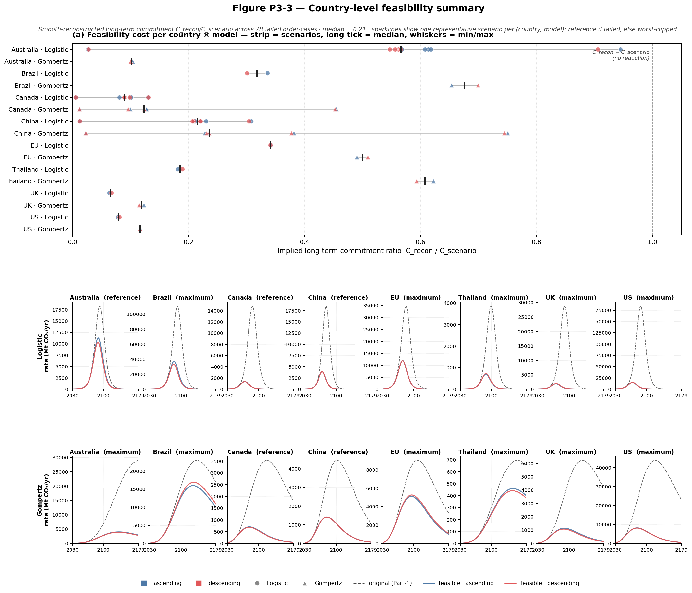
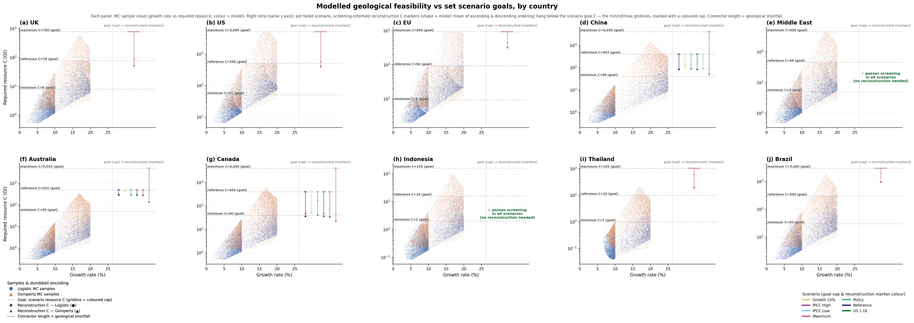
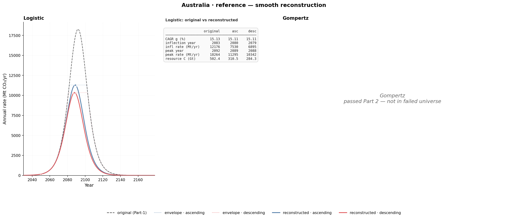
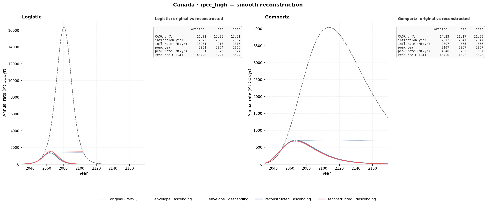

# 03: Feasible Growth (Part 3)

For every Part-2 *failed* `(country, scenario, model, ordering)` case,
reconstruct a smooth same-family S-curve anchored to three landmarks:

1. `S0`, the 2030 cumulative storage (from Part 1)
2. `R2050`, the 2050 annual rate (from Part 1 deterministic curve)
3. `R_peak_order`, the peak annual rate actually delivered by the
   Part-2 screened path under that ordering

The reconstructed curve is the geology-respecting counterpart of the
original deterministic pathway. Part 1 says what the pathway *wants*,
Part 2 says whether geology can *deliver* it, and Part 3 says what the
pathway would have to look like if geology is respected.

Full design spec: [`README_NOTES.md`](README_NOTES.md).

## What this part answers

Part 3 is structured around three paper-facing questions.

| Question | Artefact | Headline answer |
|---|---|---|
| Q1. For each failed case, what does a geology-respecting smooth pathway look like? | `output/smooth_reconstruction_summary.csv` + Fig P3-3 | 78 ordering-specific reconstructions (39 failed cases × 2 orderings; all solved), median `C_recon/C_scenario` = 0.21 (i.e., ~79% reduction in implied long-term storage commitment) |
| Q2. How faithful is each reconstruction to the year-by-year envelope? | Fig P3-1 (supplementary) + summary CSV columns | 14 of 78 cases fully consistent; median 20 years of exceedance (out of 150); median RMSE 756 Mt/yr |
| Q3. When re-screened, does the smooth reconstruction deliver? | `output/reconstructed_rescreen_summary.csv` + Fig P3-2 basin replay | all 78 / 78 pass re-screening under the same ordering (median unmet 0.0 Gt); anchoring to the screened peak makes the reconstruction basin-deliverable |

The reconstruction methodology is landmark-matched rather than
envelope-strict: it picks the smooth same-family curve that hits the
three anchors. The full-envelope fit quality is reported as a
diagnostic, never imposed as a hard constraint, and this is what makes
the Logistic late-tail problem disappear.

## Pipeline

```
Part 1 outputs                   Part 2 outputs
scalars_central.csv              shortfall_windows x 2 orderings
timeseries_central.csv           screened_paths x 2 orderings

   Part 3: 3-landmark smooth solve for each failed
   (country, scenario, model, ordering) tuple

   smooth_reconstruction_summary.csv  (78 rows)
   smooth_reconstruction_timeseries.csv (35,100 rows)
   reconstructed_rescreen_summary.csv (78 rows)
   reconstructed_assignment.csv
   fig_country_feasibility_summary.{pdf,png}   (paper main)
   fig_envelope_consistency.{pdf,png}          (supplementary)
   fig_global_country_growth_vs_resource.{pdf,png} (paper main)
   country_profiles/{country}_{scenario}_reconstruction.*  (23 profiles)
```

The reproducible workflow is the three-script pipeline in [`code/`](code/):
`build_part3_input_table.py` -> `build_part3_reconstruction.py` ->
`build_part3_rescreen.py`. The notebooks render the paper figures from those
CSV outputs: [`notebooks/part3_feasible_growth.ipynb`](notebooks/part3_feasible_growth.ipynb)
and [`notebooks/global_country_growth_vs_resource_2026-05-17.ipynb`](notebooks/global_country_growth_vs_resource_2026-05-17.ipynb).

## Reconstruction methodology in one paragraph

For each failed ordering-specific case, the unknown `(C_recon, r_recon)`
is solved from the 2-equation system:

```
peak_rate(model, C_recon, r_recon)     = R_peak_order
rate_at_2050(model, C_recon, S0, r_recon) = R2050
```

Substituting the peak constraint (`r·C = 4·R_peak` for Logistic,
`r·C = e·R_peak` for Gompertz) reduces this to a 1-variable equation
in `r`. The notebook scans `r` over a grid, brentq-solves each sign
change, then applies the post-2050 peak rule (§4.4 of the design
notes) to pick the natural branch. The CAGR descriptor `g_recon` is
recovered via Part 1's `r → g` inverse mapping.

## Figure P3-3: Country-level feasibility summary (paper main)

This is the single figure that carries the Part-3 result into the paper
main text. It has two panels with complementary roles.



### Panel (a): Feasibility cost forest plot

The y axis is the country × model combination (16 rows = 8 countries × 2
models). The x axis is `C_recon / C_scenario` (0 to 1), with a reference
line at 1.0 marking "no reduction" (geology imposes no commitment
shrink). For each row, all failed scenarios are plotted as a strip of
dots, where colour gives the ordering (blue = ascending, red =
descending) and marker shape gives the model (circle Logistic, triangle
Gompertz). A thick vertical tick sits at the median of the strip and
thin whiskers run from min to max across the row. The panel reads as how
much of the country's long-term storage commitment survives the geology
constraint, decomposed by model and ordering.

Things worth noting:

* Canada, UK, and US sit far left (median ratios around 0.09 to 0.10), heavy clipping. These countries' basin portfolios cannot sustain the original demand-rate target, so the smooth geology-respecting counterpart implies a much smaller long-term commitment.
* Australia, Brazil, China, EU, and Thailand sit further right (median ratios around 0.22 to 0.56), moderate clipping, with substantial scenario sensitivity in Australia and China.
* Ascending and descending dots almost coincide within each row: the ordering doesn't shift the reconstruction much when the three landmarks are pinned.
* The 1.0 reference line is unreached by every case. There is no scenario where the geology-respecting smooth curve preserves the original C.

### Panel (b): Original vs feasible curve sparklines

Two rows × 8 country columns. The top row is Logistic, one sparkline per
country, using each country's Logistic representative scenario
(`reference` if failed, else the scenario with smallest
`C_recon/C_scenario`). The bottom row is Gompertz, same idea with the
model-specific representative. Each sparkline plots the original Part-1
deterministic curve (grey dashed), the feasible reconstruction under
ascending ordering (blue solid), and the feasible reconstruction under
descending ordering (red solid).

Things worth noting:

* Logistic row: sharp bell shapes. Original peaks reach 17 000 to 175 000 Mt/yr depending on country. The feasible reconstructions are dramatically lower bells, same shape but much smaller magnitude. Australia and Canada are the clearest examples.
* Gompertz row: asymmetric curves that rise fast and decline slow. Original peaks are 3 to 4 times lower than the Logistic peaks for the same country. The feasible reconstructions remain close to the original tails in some cases (e.g., UK, US `maximum`) but are heavily clipped at the peak.
* The contrast between the Logistic and Gompertz rows is itself a paper-relevant finding. Logistic growth scenarios are more peak-rate constrained than Gompertz scenarios for the same country, because Logistic concentrates more rate into a sharper peak.

Subtitle line:

> *Smooth-reconstructed long-term commitment `C_recon/C_scenario` across 78 failed order-cases: median = 0.21. Sparklines show one representative scenario per (country, model): `reference` if failed, else worst-clipped.*

## Figure P3-4: Global growth–resource scatter (geological commitment by scenario)

A multi-country companion to Fig P3-3. One square panel per country
splits the story into two halves on a shared log-`C` y-axis.



The left half is technical/free growth–resource space: the Part-1
Monte-Carlo cloud from `minimum`, `reference`, `maximum`, and `growth10`.
Here x = growth rate (CAGR, %), y = required geological resource `C` (Gt,
log scale), and colour = growth model (blue = Logistic, orange =
Gompertz). Policy-, US1Gt-, and IPCC-constrained MC clouds are not
overplotted; those scenarios enter through the deterministic
reconstruction strip when they fail Part 2.

The right half is the screening-informed reconstruction strip: for each
failed deterministic scenario, the scenario resource goal is shown as a
coloured cap on the corresponding `C_scenario` level, and the
reconstruction resource `C_recon` (mean of the ascending and descending
orderings) hangs below as a small marker (filled circle Logistic, filled
triangle Gompertz), colour = scenario. The connector length is the
geological shortfall (goal `C_scenario` to reconstruction `C_recon`).

Indonesia and Middle East passed all Part-2 deterministic screening
cases, including `maximum`, so no Part-3 reconstructed commitment is
defined for them and they carry no reconstruction markers.

What it supports:

- Given the same country-level feasible growth–resource space, different scenarios demand very different long-term geological commitments.
- For most failed scenarios the screening-informed reconstruction amount sits well below the original scenario resource goal.
- This compression is strongest for Canada, China, and US.
- Logistic and Gompertz do not always respond alike. For instance Canada · `ipcc_high` has Gompertz *below* Logistic in resource `C` (a near-degenerate, tight-headroom case where the screened peak rate barely exceeds the imposed 2050 rate), reversing the usual ordering.

Notebook: [`notebooks/global_country_growth_vs_resource_2026-05-17.ipynb`](notebooks/global_country_growth_vs_resource_2026-05-17.ipynb) · point tables in [`output/global_country_scatter/`](output/global_country_scatter/).

## Worked examples: two country-specific profiles

Two country profile figures from `output/figures/country_profiles/`,
chosen to contrast a moderate-clip Type-A case with a heavy-clip
Type-B_fixed case.

### Example 1: Australia · reference (moderate clip, Logistic-only failure)



Scenario `reference` is the central pathway for Australia under fixed
`C_scenario = 502.4 Gt`. Logistic fails Part 2 under both orderings;
Gompertz passes Part 2 (so its panel is a "passed Part 2" placeholder).

Logistic panel:

| Metric | Original | Asc feasible | Desc feasible |
|---|---:|---:|---:|
| CAGR g (%) | 15.13 | 15.11 | 15.11 |
| Inflection year | 2083 | 2080 | 2079 |
| Infl. rate (Mt/yr) | 12 176 | 7 530 | 6 895 |
| Peak year | 2092 | 2089 | 2088 |
| Peak rate (Mt/yr) | 18 263 | 11 295 | 10 342 |
| Reconstruction C (Gt) | 502.4 | 310.5 | 284.3 |

The visual story: the curve shape is preserved, with CAGR moving only
from 15.13% to 15.11% (a single S-curve family, same growth dynamics).
The peak rate is clipped by 38 to 43%, from 18.3 Gt/yr down to 11.3
(asc) or 10.3 (desc) Gt/yr, so the geology ceiling shows clearly. The
peak year shifts 3 to 4 years earlier (2092 to 2089 asc / 2088 desc),
because lowering the peak rate at fixed `S0` and `rate_2050` requires the
curve to peak sooner and decay sooner. Long-term commitment falls from
502 Gt to 284–311 Gt, so Australia preserves 57 to 62% of its
`reference` scenario commitment under geology. On envelope fit, 0 of 150
years exceed the envelope: the smooth fit stays at or below the screened
path throughout, so this case is fully envelope-consistent with no
drift.

This is the moderate-clip archetype: geology trims the curve but doesn't
reshape it. The reader sees a smaller-but-recognisable Logistic bell with
the same character.

### Example 2: Canada · ipcc_high (heavy clip, both models fail, externally anchored 2050)



Scenario `ipcc_high` is a `Type == B_fixed` case: Canada's 2050 storage
rate is externally fixed at the IPCC-high target, with `C_scenario = 404
Gt`. Both Logistic and Gompertz fail Part 2, so the figure has two
complete comparison panels.

Logistic panel:

| Metric | Original | Asc feasible | Desc feasible |
|---|---:|---:|---:|
| CAGR g (%) | 16.92 | 17.28 | 17.21 |
| Inflection year | 2073 | 2056 | 2057 |
| Peak year | 2081 | 2064 | 2065 |
| Peak rate (Mt/yr) | 16 351 | 1 376 | 1 524 |
| Reconstruction C (Gt) | 404.0 | 32.7 | 36.4 |

Gompertz panel:

| Metric | Original | Asc feasible | Desc feasible |
|---|---:|---:|---:|
| CAGR g (%) | 14.23 | 21.17 | 21.38 |
| Peak rate (Mt/yr) | 4 040 | 702 | 687 |
| Reconstruction C (Gt) | 404.0 | 40.2 | 38.8 |

The visual story: long-term commitment collapses by an order of
magnitude, from 404 Gt down to 33–40 Gt, a ~90 to 92% reduction. This is
the heavy-clip archetype. Peak rate is clipped ~11 to 12 times under
Logistic and ~6 times under Gompertz. Peak year shifts 16 to 17 years
earlier (2081 to 2064–2065 under Logistic) because the curve is forced to
peak much sooner: the smaller `C_recon` can't sustain growth past the
geology-imposed peak rate ceiling for long.

The CAGR direction-of-change is different in Gompertz: `g` goes up from
14.2% to ~21.2%, because for Gompertz a smaller `C` with the same `S0`
plus `rate_2050` requires a steeper early ramp to hit the 2050 anchor
before the rapid decay sets in. The CAGR sign tells you whether the
smooth fit is steeper or shallower than the original, and it can go
either way depending on which model family and how much C shrinks.

On envelope fit there is drift: 20 years exceeding in both panels (the
full extent of the post-peak tail where the original-demand decay rate
doesn't match the reconstructed-curve decay rate). This is the §5 honesty
diagnostic from the design notes, and Canada · ipcc_high is one of the
cases where the smooth landmark fit is not envelope-strict.

This is the heavy-clip archetype, made more interesting by the externally
anchored 2050 target. Even with the 2050 rate fixed by policy, geology
forces the long-term commitment to fall by 91%.

### What these two together tell the paper

Some countries get a trimmed but recognisable geology-respecting pathway
(Australia · reference, moderate clip); others get a reshaped and reduced
pathway (Canada · ipcc_high, heavy clip). The same six landmarks (CAGR,
t_n, infl. rate, t_p, peak rate, reconstruction C) per panel capture the
full story, and the table format is comparable across all 23
country-scenario figures in [`output/figures/country_profiles/`](output/figures/country_profiles/).

## Output files

```
output/
  part3_input_table.csv                       input table (300 rows; 78 reconstruction targets)
  smooth_reconstruction_summary.csv           main analytical table (78 rows x 35 cols)
  smooth_reconstruction_timeseries.csv        long-format curves (35,100 rows)
  reconstructed_rescreen_summary.csv          closed-loop re-screening summary (78 rows)
  reconstructed_assignment.csv                basin allocation checkpoints for reconstructed curves
  global_country_scatter/                     Fig P3-4 point tables
    country_mc_scatter_points.csv             technical/free MC cloud points (153,767 rows)
    country_reconstruction_points.csv         reconstruction markers (right strip, 78 rows)
  figures/
    fig_country_feasibility_summary.{pdf,png}        Fig P3-3 paper main
    fig_global_country_growth_vs_resource.{pdf,png}  Fig P3-4 paper main
    fig_envelope_consistency.{pdf,png}               Fig P3-1 supplementary
    country_profiles/
      {country}_{scenario}_reconstruction.{pdf,png}  23 profiles x 2 formats
```

### `smooth_reconstruction_summary.csv`: key columns

| Column | Meaning |
|---|---|
| `country, scenario, model, ordering` | case identifiers |
| `Type` | `A` (MC-derived) or `B_fixed` (externally anchored 2050) |
| `S0_gt, C_scenario_gt, g_cap, g_original, r_original` | original Part-1 inputs |
| `rate_2050_original, tn_original, tp_original` | Part-1 deterministic landmarks |
| `R_peak_order, Y_peak_order` | Part-2 screened peak (landmark 3) |
| `C_recon_order_gt, g_recon_order, r_recon_order` | reconstructed long-term commitment + curve parameters |
| `rate_2050_recon_order, peak_rate_recon_order, peak_year_recon_order, tp_recon_order, tn_recon_order` | reconstructed-curve derived values |
| `C_ratio_recon_to_scenario` | the headline metric: `C_recon / C_scenario` |
| `delta_tp_recon_vs_original, delta_peak_year_recon_vs_screened` | timing shifts |
| `max_envelope_exceedance_mt_yr, years_exceeding_envelope, first_exceed_year, last_exceed_year, rmse_to_envelope_mt_yr, envelope_consistent` | §5 envelope-fit diagnostics |
| `landmark_infeasible, landmark_reason, violates_g_cap` | solver flags |

### `reconstructed_rescreen_summary.csv`: key columns

| Column | Meaning |
|---|---|
| `country, scenario, model, ordering` | reconstructed case identifiers |
| `rescreen_status` | closed-loop allocation status (`ok` for all 78 current cases) |
| `rescreen_pass` | whole-period pass/fail after re-screening the reconstructed curve |
| `rescreen_total_unmet_gt, rescreen_years_of_shortfall` | residual unmet volume and shortfall-year count after re-screening |
| `rescreen_total_wells_2050, rescreen_total_wells_2100` | checkpoint well counts under the reconstructed curve |
| `rescreen_active_basins_2050, rescreen_active_basins_2100` | active basin counts under the reconstructed curve |

## Per-country summary

| Country | Failed scenarios | Order-cases | median ratio | min ratio | Interpretation |
|---|---:|---:|---:|---:|---|
| Australia | 6 | 14 | 0.56 | 0.026 | Most scenarios moderate; `maximum` extreme |
| Brazil | 1 | 4 | 0.49 | 0.301 | Only `maximum` fails; moderate to high commitment retained |
| Canada | 6 | 22 | 0.09 | 0.006 | Heavy across all scenarios |
| China | 6 | 22 | 0.22 | 0.013 | Moderate; `maximum` extreme |
| EU | 1 | 4 | 0.42 | 0.341 | Only `maximum` fails; moderate |
| Thailand | 1 | 4 | 0.38 | 0.183 | Only `maximum` fails; moderate |
| UK | 1 | 4 | 0.09 | 0.064 | Only `maximum`; heavy clip |
| US | 1 | 4 | 0.10 | 0.078 | Only `maximum`; heavy clip |

## How to regenerate

Run the three-script pipeline first:

```bash
cd 03_feasible_growth
python code/build_part3_input_table.py
python code/build_part3_reconstruction.py
python code/build_part3_rescreen.py
```

`build_part3_rescreen.py` replays the Part-2 allocation engine on the 78
reconstructed curves; it does not rerun Part-1 MC or Step-1 basin precompute.

Then render the paper figures from the refreshed CSV outputs:

```bash
cd 03_feasible_growth/notebooks
jupyter nbconvert --to notebook --execute --inplace \
    --ExecutePreprocessor.kernel_name=python3 \
    --ExecutePreprocessor.timeout=600 \
    part3_feasible_growth.ipynb

jupyter nbconvert --to notebook --execute --inplace \
    --ExecutePreprocessor.kernel_name=python3 \
    --ExecutePreprocessor.timeout=600 \
    global_country_growth_vs_resource_2026-05-17.ipynb
```

The notebooks are deterministic given the Part-1, Part-2, and Part-3 CSV
outputs.

## Closed-loop re-screening

The §6 design-note check is complete for V8. Each reconstructed curve is fed
back into the Part-2 allocation engine under its own ordering, using the same
country-level basin caches and MATLAB-faithful allocation rule. All 78
reconstructed curves pass whole-period re-screening with `0.0 Gt` unmet volume.

## Reference

- Part 1: [`../01_growth_model/`](../01_growth_model/)
- Part 2: [`../02_co2block_screening/`](../02_co2block_screening/)
- Part 3 design spec: [`README_NOTES.md`](README_NOTES.md)
