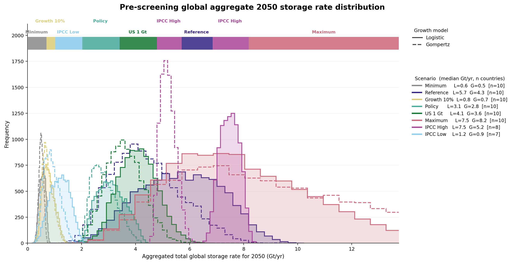
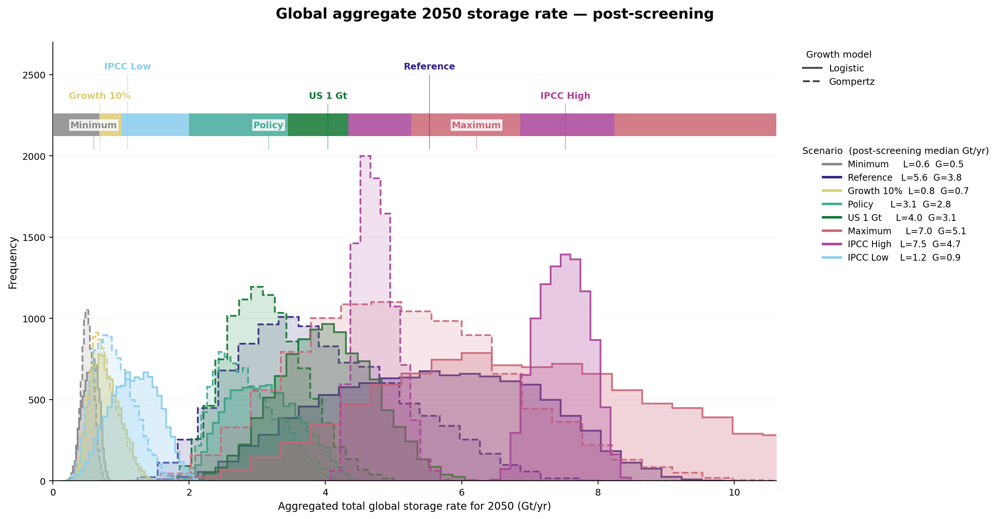
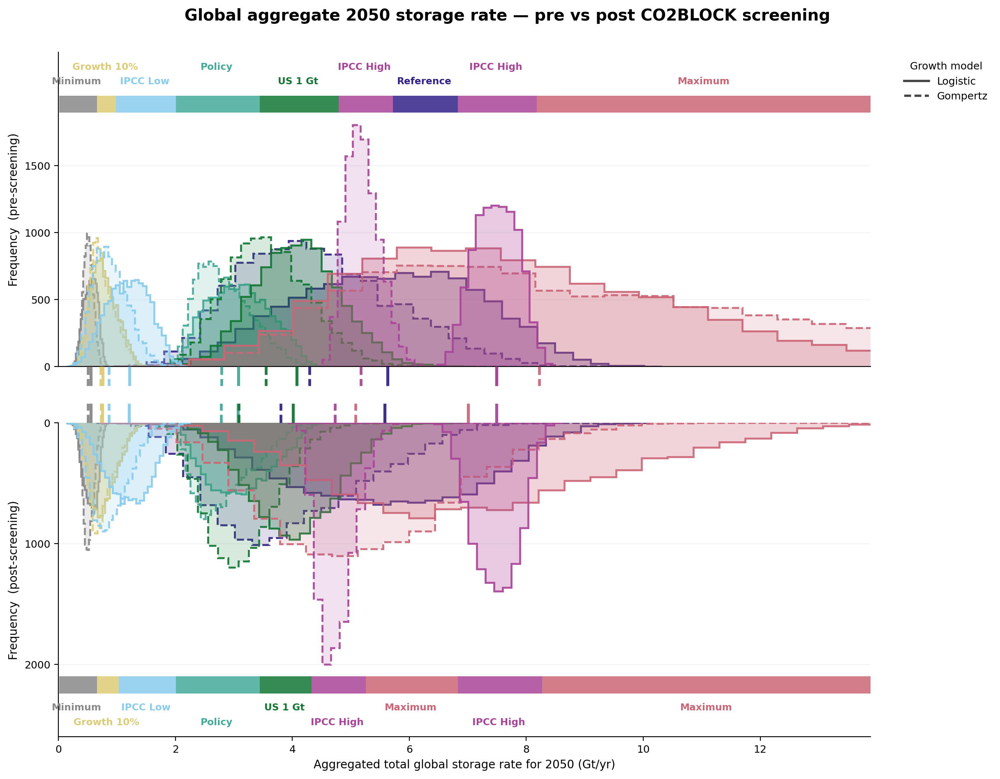

# 04. Global aggregate 2050 storage rate

## Current V8 status

Active V8 paper-ready package, regenerated 2026-06-01 from the V8 upstream
chain. This is the terminal step of the pipeline:

```
01_growth_model -> 02_co2block_screening -> 03_feasible_growth -> 04_global_aggregate_2050
   (Part-1 MC)        (CO2BLOCK screen)       (C_recon for fails)    (this module)
```

Both notebooks here are pure downstream consumers: they re-run no Monte-Carlo
and no CO2BLOCK. They read:

- `01_growth_model/output/v8_2026-06-01/samples_*.csv`, the Part-1 MC pool (`rate_2050`, `C_sampled`).
- `03_feasible_growth/output/part3_input_table.csv`, `C_scenario_gt` and pass/fail for all 150 central cells.
- `03_feasible_growth/output/smooth_reconstruction_summary.csv`, `C_recon_order_gt` for the 78 failed (cell × ordering) reconstruction targets.

### V8 country pool

10 regions: Australia, Brazil, Canada, China, EU (EU excluding UK), Indonesia,
Middle East, Thailand, UK, US. Versus v7, South Korea was dropped and Brazil
added, and EU was redefined as EU without UK. South Korea appears in zero v8
outputs.

Two scenarios have an incomplete MC pool (no feasible Part-1 samples for some
countries; not backfilled): `ipcc_high` = 8 regions, `ipcc_low` = 7 regions. The
per-scenario `n_countries` is recorded in `global_aggregate_2050_summary.csv` and in
the figure legend.

Per-scenario distributions of the global aggregate 2050 CO₂ storage rate (Gt/yr), built by bootstrap-convolving country-level Monte-Carlo samples from `01_growth_model/output/v8_2026-06-01/samples_*.csv` (Part-1, `rate_2050` column). Pre-screening (raw Part-1 MC) and CO2BLOCK-informed post-screening (Part-1 MC filtered by the Part-3 `C_recon_order_gt` resource ceiling) are compared.

Reference: Zhang et al. *Nat. Commun.* (2024) Fig. 3(b), the same global-aggregate idea, adapted for our independent-per-country MC structure (bootstrap convolution instead of index-paired summation).

## Three paper-main figures

### 1. Pre-screening histograms



Per-scenario 32-bin histograms over each scenario's own data range (bin width therefore varies). Coloured ribbon along the top shows which scenario has the highest KDE density in each x-region; left-to-right ordering is `Minimum · Growth 10% · IPCC Low · Policy · US 1 Gt · IPCC High · Reference · IPCC High · Maximum`.

Pre-screening combined-model median 2050 rates: `Maximum` 7.8 · `IPCC High` 6.4 · `Reference` 4.9 · `US 1 Gt` 3.8 · `Policy` 2.9 · `IPCC Low` 1.0 · `Growth 10%` 0.7 · `Minimum` 0.5 Gt/yr.

### 2. Post-screening histograms (CO2BLOCK-informed)



Same layout as Fig 1 but using the CO2BLOCK-informed filtered sample pool. Per (scenario, country, model), Part-1 MC samples are kept only when `C_sampled ≤ C_screened`, where:

- `C_screened = C_recon_order_gt` (min over asc/desc orderings) if the case failed Part-2 and was reconstructed in Part-3.
- `C_screened = C_scenario_gt` if the case passed Part-2 (geology has already validated the scenario's design C).

The passed-case ceiling is effectively a no-op: across all 316,029 v8 MC samples, `C_sampled ≤ C_scenario_gt` holds with 0 violations, so passed cells keep their entire pool. All of the post-screening reduction therefore comes from the 39 failed cells, whose `C_recon_order_gt` ceiling is well below the design `C_scenario` (median C_recon/C_scenario ≈ 0.21 in Part-3).

One country pool becomes empty under filtering and is excluded from the post-screening bootstrap: Canada · Gompertz · IPCC High, whose smallest `C_sampled = 49.9 Gt` exceeds the cap `C_cap_min = 38.8 Gt` (mean ceiling: 39.5 Gt), so no sample survives. This is distinct from `IPCC Low · Canada · Logistic`, a central cell that has a resolved ceiling but no MC pool at all (Canada is not in the `ipcc_low` MC pool), hence 149 MC cells filtered, not 150.

Note that this is a CO2BLOCK-informed resource-ceiling filter, not a full CO2BLOCK run over every MC trajectory. CO2BLOCK is evaluated only on each scenario's deterministic central pathway in Part-2; the resulting per-cell screened resource ceiling is then used to mask the Part-1 MC pool.

### 3. Pre/post mirror



Two stacked subplots sharing the X-axis:

- Top: pre-screening 2050 rate histograms (frequency up).
- Bottom: post-screening 2050 rate histograms (frequency down).

Both halves carry their own dominance ribbon (top edge of ax_top and bottom edge of ax_bot); any divergence in scenario ordering or run width between the two ribbons IS the screening effect.

In the **gap between the two halves**, small outward-pointing tick lines mark the per-(scenario, model) median 2050 rate: solid = Logistic, dashed = Gompertz, colour = scenario. The horizontal offset of a scenario's pre tick (top half, pointing down) and post tick (bottom half, pointing up) is the median shift due to screening.

Median 2050-rate shifts (pre to post, min ceiling, Gt/yr):

| Scenario · Model | Pre → Post | Reduction |
|---|---|---:|
| Maximum · G | 8.2 → 5.1 | −38% |
| US 1 Gt · G | 3.6 → 3.1 | −13% |
| Reference · G | 4.3 → 3.8 | −12% |
| IPCC High · G | 5.2 → 4.7 | −9% |
| Maximum · L | 7.5 → 7.0 | −6% |
| US 1 Gt · L | 4.1 → 4.0 | −2% |
| All other (scenario, model) | ≈ 0 |  |

The reduction concentrates on the Gompertz paths of the high-ambition scenarios (Maximum, US 1 Gt, Reference, IPCC High), whose central curves failed Part-2 and were reconstructed to a much smaller feasible `C`. Logistic paths and the low-ambition scenarios (Minimum, Growth 10%, IPCC Low, Policy) sit under their CO2BLOCK ceilings and are essentially unchanged.

The min (main, conservative) and mean (sensitivity) ceilings give nearly identical medians: every reduction above differs by ≤1 percentage point between the two, confirming the result is robust to the choice of order-aggregation of `C_recon` across ascending/descending CO2BLOCK orderings.

Reading the ribbon divergence: `Maximum`'s right-tail stretch shrinks post-screening, allowing `IPCC High` and `Reference` to extend slightly further right; below ~2 Gt/yr the pre and post ribbons are essentially identical because those scenarios sit under their CO2BLOCK ceilings.

## Output files

```
output/
  global_aggregate_2050_bootstrap.csv                    160 000 rows = 8 scenarios x 2 models x 10 000 draws (pre-screening)
  global_aggregate_2050_summary.csv                      16 rows: per (scenario, model) median/p5/p95 + n_countries
  global_2050_rate_C_ceiling_screening_bootstrap.csv     320 000 rows = 160 000 x {min, mean} ceiling; cols unscreened/screened
  C_ceiling_resolved_per_cell.csv                        150 cells: C_scenario_gt, C_recon_min/mean, C_cap_final (39 failed)
  C_ceiling_diagnostic_per_country_scenario_model.csv    298 rows = 149 MC cells x {min, mean}: n_before/after, kept_frac, excluded flag
  C_ceiling_empty_pools.csv                              2 rows: Canada·Gompertz·IPCC High emptied under each ceiling
  C_ceiling_2050_rate_median_summary.csv                 16 rows: median + reduction-% (min & mean) per (scenario, model)
  figures/
    fig_global_aggregate_2050_histograms.{png,pdf}                    Fig (1) above
    fig_global_aggregate_2050_histograms_post_screening.{png,pdf}     Fig (2) above
    fig_global_aggregate_2050_pre_post_mirror.{png,pdf}               Fig (3) above
```

On bootstrap rows vs MC cells: the 160 000 pre-screening rows are world draws (10 000 per scenario × model), not raw samples. They are bootstrap convolutions over the 149 contributing MC (scenario, country, model) cells. The 320 000 post-screening rows double the 160 000 across the two ceilings (min + mean).

## Methodology in one paragraph

For each (scenario, model), each country's Part-1 MC `rate_2050` array is sampled with replacement `N_BOOT = 10 000` times (`numpy.random.default_rng`, seed 42; the post-screening unscreened/min/mean draws use deterministic seed offsets +0/+3/+4). The `i`-th world bootstrap draw is the sum across countries of their `i`-th drawn `rate_2050`. The result is the empirical distribution of the global aggregate 2050 storage rate under the assumption that regional MCs are independent (a bootstrap convolution, since `sample_idx` is not paired across our independently-run per-country MCs). Post-screening repeats the same procedure on a filtered pool where each country's MC samples are kept only when `C_sampled ≤ C_screened` (see Fig 2 caption); a country whose filtered pool is empty is excluded.

## How to regenerate

```bash
cd 04_global_aggregate_2050/notebooks

jupyter nbconvert --to notebook --execute --inplace \
    --ExecutePreprocessor.kernel_name=iman_pygis \
    --ExecutePreprocessor.timeout=600 \
    global_2050_storage_rate_histograms.ipynb       # Fig 1

jupyter nbconvert --to notebook --execute --inplace \
    --ExecutePreprocessor.kernel_name=iman_pygis \
    --ExecutePreprocessor.timeout=600 \
    co2block_informed_screening_2050_rate.ipynb     # Figs 2 + 3
```

Both notebooks are deterministic given the Part-1 MC samples and the Part-3 reconstruction outputs; no re-running of MC or CO2BLOCK is required. The post-screening notebook asserts that every MC cell resolves a C ceiling before bootstrapping (strict coverage guard).

## Colour palette

All figures use Paul Tol's "Muted" colourblind-safe palette (Tol 2018, SRON Technical Note SRON/EPS/TN/09-002):

| Scenario | Hex |
|---|---|
| Minimum | `#888888` medium grey |
| Growth 10% | `#DDCC77` sand |
| IPCC Low | `#88CCEE` light blue |
| Policy | `#44AA99` teal |
| US 1 Gt | `#117733` green |
| Reference | `#332288` indigo |
| IPCC High | `#AA4499` purple |
| Maximum | `#CC6677` rose |

The same palette is used by the Part-3 country scatter figure (`03_feasible_growth/output/figures/fig_global_country_growth_vs_resource.png`) for consistency across the paper.

## Reference

- Part 1 (growth-curve MC): [`../01_growth_model/`](../01_growth_model/)
- Part 2 (CO2BLOCK screening): [`../02_co2block_screening/`](../02_co2block_screening/)
- Part 3 (feasible-growth reconstruction): [`../03_feasible_growth/`](../03_feasible_growth/)
- Reference paper: Zhang et al. (2024) *Nat. Commun.* 15:5723, Fig 3(b).
